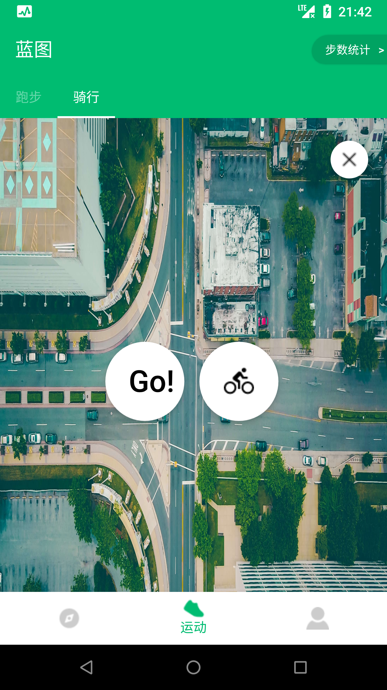
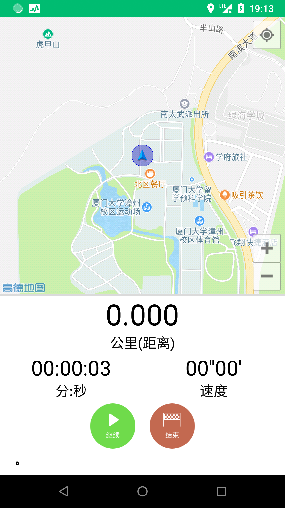
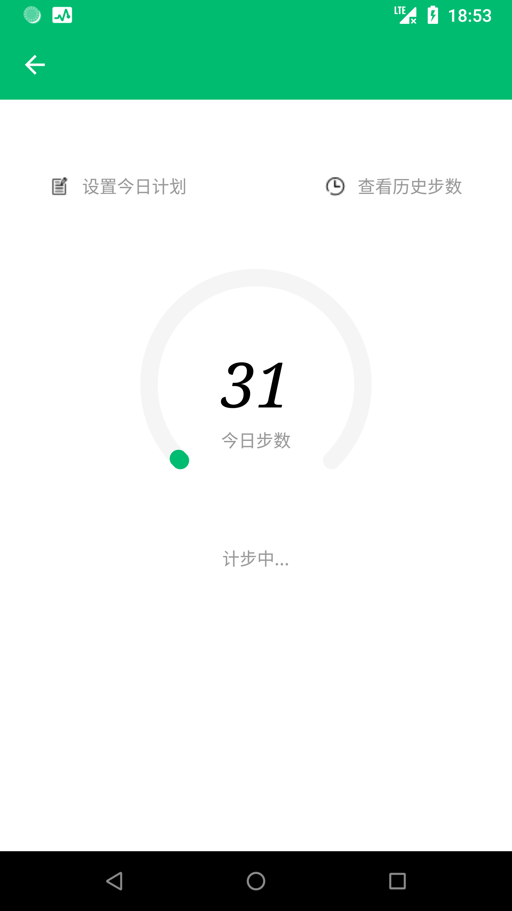
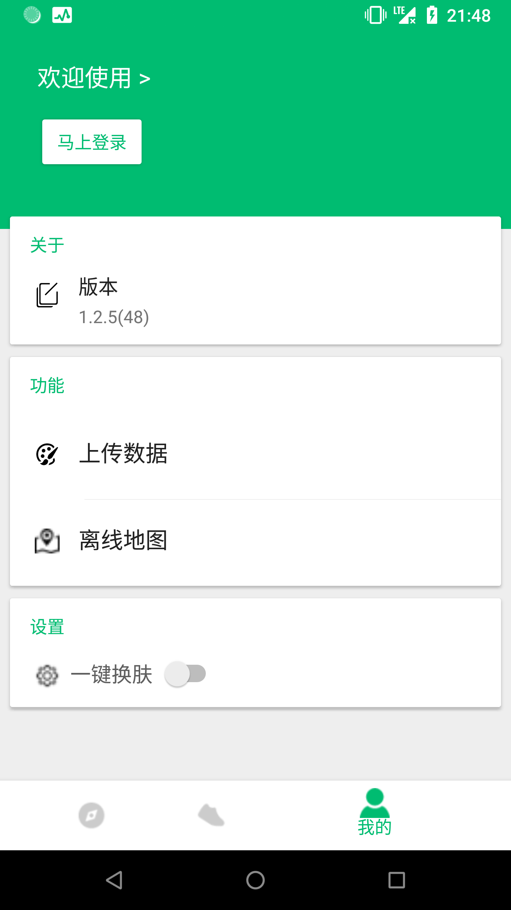

# 蓝图运动App

基于Material Design设计开发的运动App。主要实现运动信息展示，轨迹记录，步数统计，后台登录注册等功能。代码开源仅用于交流学习。
### 下载
[应用体验](http://www.firhq.com/)(暂时关闭下载)
### 预览
&nbsp;&nbsp;&nbsp;&nbsp;
 
&nbsp;&nbsp;

### Todo-List
- [ ] 记录页Toolbar back点击失效
- [ ] Android O Notification适配
- [ ] 第三方登录还需要完善
  
### 联系：
项目需要完善的地方还有很多，如有BUG或者更好的建议欢迎提出
* [issue](https://github.com/Lavanidad/Blueprint/issues)
* [微博](https://weibo.com/5305694609/profile?rightmod=1&wvr=6&mod=personnumber&is_all=1) 
* mail: imdeepspring@gmail.com

### 第三方：
* [`Okhttp`](https://github.com/square/okhttp)
* [`ZXing`](https://github.com/yipianfengye/android-zxingLibrary)
* [`Gson`](https://github.com/google/gson)
* [`Butterknife`](https://github.com/JakeWharton/butterknife)
* [`Glide`](https://github.com/bumptech/glide)
* [`EventBus`](https://github.com/greenrobot/EventBus)
* [`Logger`](https://github.com/orhanobut/logger)

### 参考资料：
* [`计步开发`](https://www.jianshu.com/p/5d57f7fd84fa)
* [`地图开发`](https://blog.csdn.net/i_do_can/article/details/50571657)
* [`大神博客待整理`](https://blog.csdn.net/)

